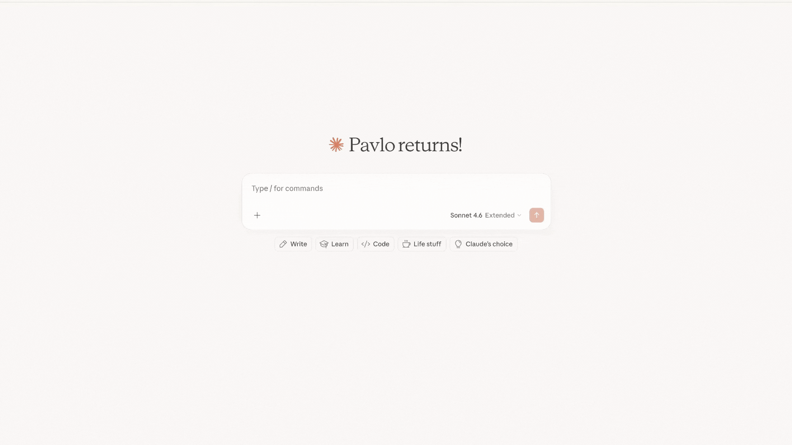

# mcp-webinar

Materials for a webinar about **MCP (Model Context Protocol)**.

The project shows the *same* agent gaining tools five different ways, so you can
see exactly what MCP adds over hand-written tools — and how auth fits in.

| # | Demo | Host app | MCP server |
|---|------|----------|------------|
| 1 | Custom tools, no MCP | `host/app_custom_tools.py` | — |
| 2 | MCP over Streamable HTTP | `host/app_mcp_no_auth.py` (`TRANSPORT="http"`) | `servers/http_server.py` |
| 3 | MCP over stdio | `host/app_mcp_no_auth.py` (`TRANSPORT="stdio"`) | `servers/stdio_server.py` (auto-spawned) |
| 4 | MCP with API-key auth | `host/app_mcp_auth.py` (`AUTH="api_key"`) | `servers/api_key_mcp_server.py` |
| 5 | MCP with OAuth (Keycloak) | `host/app_mcp_auth.py` (`AUTH="oauth"`) | `servers/oauth_mcp_server.py` |

The agent always works against the **[mock User Service](https://github.com/khshanovskyi/mock-user-service)** (search / read / create /
update / delete users).


## Setup

```bash
python -m venv .venv && source .venv/bin/activate
pip install -r requirements.txt

export OPENAI_API_KEY=sk-...          # required
# optional overrides: OPENAI_MODEL, MCP_API_KEY, *_URL (see commons/constants.py)

# mock User Service (all demos need it); Keycloak (only demo 5)
docker compose up -d userservice
```

Run every command below from the **repository root**.

### Demo 1 — custom tools
```bash
python -m host.app_custom_tools
```

---

### Demo 2 — MCP over HTTP
```bash
python -m servers.http_server          # terminal 1
python -m host.app_mcp_no_auth         # terminal 2  (TRANSPORT="http")
```

---

### Demo 3 — MCP over stdio
Set `TRANSPORT="stdio"` in `host/app_mcp_no_auth.py` (the server is spawned for you):

```bash
python -m host.app_mcp_no_auth         # choose "stdio" when prompted
```

<details> 
<summary><b>Connecting your STDIO MCP server to Claude Desktop</b></summary>

This uses your `servers/stdio_server.py` entry point — simplest and most reliable for local development.

### Step 1: Find the Claude Desktop config file

| OS          | Path                                                              |
|-------------|-------------------------------------------------------------------|
| **macOS**   | `~/Library/Application Support/Claude/claude_desktop_config.json` |
| **Windows** | `%APPDATA%\Claude\claude_desktop_config.json`                     |

### Step 2: Edit the config

Open the file (create it if it doesn't exist) and add your server:

```json
{
  "mcpServers": {
    "users-management": {
      "command": "{ABSOLUTE_PATH}/mcp-webinar/.venv/bin/python",
      "args": [
        "{ABSOLUTE_PATH}/mcp-webinar/servers/stdio_server.py"
      ],
      "env": {
        "PYTHONPATH": "{ABSOLUTE_PATH}/mcp-webinar"
      }
    }
  }
}
```

**Important notes:**

- Don't forget to replace `{ABSOLUTE_PATH}` with the absolute path to the project on your local machine
- Set `PYTHONPATH` to your project root so imports like `servers` and `commons` resolve correctly
- If you're using a virtual environment, point to its Python binary:
  ```json
  "command": "/path/to/your/venv/bin/python"
  ```
  On Windows: `"C:\\Users\\you\\project\\.venv\\Scripts\\python.exe"`

<details> 
<summary><b>Sample how it is done on my Mac:</b></summary>

```json
{
  "mcpServers": {
    "users-management": {
      "command": "/Users/pavlokhshanovskyi/my-courses/mcp-webinar/.venv/bin/python",
      "args": [
        "/Users/pavlokhshanovskyi/my-courses/mcp-webinar/servers/stdio_server.py"
      ],
      "env": {
        "PYTHONPATH": "/Users/pavlokhshanovskyi/my-courses/mcp-webinar"
      }
    }
  }
}
```


</details>

### Step 3: Restart Claude Desktop

Fully quit and reopen Claude Desktop. While reopening, Claude can ask for access to the project. In the connectors section you will be able to find `users-management`.

</details>

---

### Demo 4 — MCP with API key
```bash
python -m servers.api_key_mcp_server   # terminal 1
python -m host.app_mcp_auth            # terminal 2  (AUTH="api_key")
```

---

### Demo 5 — MCP with OAuth (Keycloak)
```bash
docker compose up -d keycloak
python -m servers.oauth_mcp_server     # terminal 1
# set AUTH="oauth" in host/app_mcp_auth.py
python -m host.app_mcp_auth            # terminal 2 — opens a browser to log in
```
Log in as `mcp-user` / `password` (it has the required role). The server follows
the MCP Authorization spec — it advertises `/.well-known/oauth-protected-resource/mcp`
and challenges unauthenticated calls with `401` + `WWW-Authenticate`, so the client
discovers Keycloak on its own (no endpoints hardcoded in the client).

> ⚠️ Access-token TTL is 60s on purpose, so you can demo the automatic refresh.

→ See the [**Keycloak**](#keycloak) section for credentials, endpoints, users, and Postman setup.

Type `exit` (or `quit`) to leave any chat.

---

## Keycloak

[Keycloak](https://www.keycloak.org/) is an open-source Identity and Access Management
solution. It handles user authentication, issues JWT tokens, and manages roles/permissions —
so your services don't have to implement any of that themselves.

In Demo 5 Keycloak is the **Authorization Server** in the OAuth 2.0 flow: it authenticates
the user via a browser login page and issues a signed JWT access token that the MCP server
validates on every request.

How the pieces map to the MCP Authorization spec in this project:

- **Resource Server** → the MCP server (`servers/oauth_mcp_server.py`). It uses fastmcp's
  `RemoteAuthProvider`, which automatically serves the protected-resource metadata at
  `http://localhost:8008/.well-known/oauth-protected-resource/mcp` and answers
  unauthenticated requests with `401` + `WWW-Authenticate`. Token validation (JWKS
  signature, issuer, required role) lives in `servers/auth/oauth.py`
  (`KeycloakRoleScopeVerifier`, a thin subclass of fastmcp's `JWTVerifier`).
- **Client** → the host (`host/mcp_client.py`, `build_oauth`). It uses fastmcp's `OAuth`
  helper, which discovers Keycloak from the server metadata, runs the PKCE browser flow,
  and refreshes tokens transparently — no Keycloak endpoints are hardcoded.

### Admin Console

|              |                       |
|--------------|-----------------------|
| **URL**      | http://localhost:8089 |
| **Username** | `admin`               |
| **Password** | `admin`               |

### Realm Configuration

The realm is pre-configured via [`_keycloak/mcp-realm-config.json`](_keycloak/mcp-realm-config.json).
On first startup Keycloak imports it automatically (`start-dev --import-realm`).

| Setting     | Value                                                         |
|-------------|---------------------------------------------------------------|
| Realm name  | `mcp-realm`                                                   |
| Client ID   | `mcp-client`                                                  |
| Client type | Public (PKCE, no client secret)                               |
| Token TTL   | **60 seconds** ⚠️ (intentionally short to test token refresh) |

### Keycloak Endpoints

| Endpoint                   | URL                                                                     |
|----------------------------|-------------------------------------------------------------------------|
| Well-known / OpenID config | http://localhost:8089/realms/mcp-realm/.well-known/openid-configuration |
| JWKS (public keys)         | http://localhost:8089/realms/mcp-realm/protocol/openid-connect/certs    |
| Token                      | http://localhost:8089/realms/mcp-realm/protocol/openid-connect/token    |
| Authorize                  | http://localhost:8089/realms/mcp-realm/protocol/openid-connect/auth     |

> The MCP server points clients at the realm above via its own protected-resource metadata:
> `curl http://localhost:8008/.well-known/oauth-protected-resource/mcp`

### Pre-configured Users

| Username         | Password   | Realm role         | MCP Access            |
|------------------|------------|--------------------|-----------------------|
| `mcp-user`       | `password` | `mcp-tools-access` | ✅ Allowed             |
| `no-access-user` | `password` | *(none)*           | ❌ `401 Unauthorized`  |

### (Optional) Test it in Postman

Postman connects **directly to Keycloak** (the authorization server) — the same endpoints
the MCP client discovers automatically. Create a new request → `POST http://localhost:8008/mcp`,
then open the **Authorization** tab:

| Parameter                 | Value                                                                |
|---------------------------|----------------------------------------------------------------------|
| Auth Type                 | `OAuth 2.0`                                                          |
| Grant type                | `Authorization Code (With PKCE)`                                     |
| Callback URL              | see options below                                                    |
| Auth URL                  | http://localhost:8089/realms/mcp-realm/protocol/openid-connect/auth  |
| Access Token URL          | http://localhost:8089/realms/mcp-realm/protocol/openid-connect/token |
| Client ID                 | `mcp-client`                                                         |
| Code Challenge Method     | `SHA-256`                                                            |
| Scope                     | `openid profile`                                                    |

Both callback URLs are registered for `mcp-client`, pick one:

- **Postman hosted** (default): `https://oauth.pstmn.io/v1/callback` — leave *Authorize using browser* unchecked.
- **Local**: `http://localhost:9999/callback` — check *Authorize using browser*.

Click **Get New Access Token**, log in as `mcp-user` / `password`, then **Use Token** and
send the request. The `mcp-tools-access` role is added to the token automatically (via
Keycloak's default `roles` scope) and the server authorizes on it — you do **not** request
it as a scope. Logging in as `no-access-user` yields a token without the role, so the server
returns `401`.
